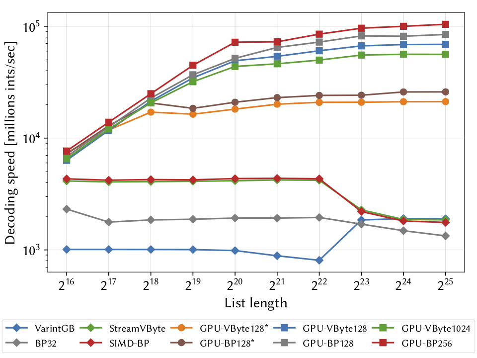

GPU Integers Compression
==========================

GPU-Accelerated Faster Decoding of Integer Lists

## Usage 

### Build
```
git clone git@github.com:amallia/gpu-integers-compression.git
cd gpu-integers-compression
mkdir build 
cd build 
cmake .. 
make -j
```

### External libraries
    - Google Test
    - Google benchmark
    - NVlabs CUB
    - FastPFor
    - CLI11 
    - Boost
    - mio
    
### Benchmark

Benchmarks tasks can be found in `bench` folder. For example you can run:
```
./bench/cuda_bp_bench
./bench/cuda_vbyte_bench
```

## Codecs

### GPU Binary-Packing
```cpp
#include "gpu_ic/cuda_bp.cuh"

// Values to encode
std::vector<uint32_t> values = {\* ... *\};

// Encode
std::vector<uint8_t> encoded_values;
encoded_values.resize(values.size() * 8);
auto compressedsize = cuda_bp::encode(encoded_values.data(), values.data(), values.size());
encoded_values.resize(compressedsize);
encoded_values.shrink_to_fit();

// Decode
std::vector<uint32_t> decoded_values;
decoded_values.resize(values.size());
CUDA_CHECK_ERROR(cudaMalloc((void **)&d_encoded, encoded_values.size() * sizeof(uint8_t)));
CUDA_CHECK_ERROR(cudaMemcpy(d_encoded, encoded_values.data(), encoded_values.size() * sizeof(uint8_t), cudaMemcpyHostToDevice));

CUDA_CHECK_ERROR(cudaMalloc((void **)&d_decoded, values.size() * sizeof(uint32_t)));
cuda_bp::decode(d_decoded, d_encoded, decoded_values.size());
CUDA_CHECK_ERROR(cudaMemcpy(decoded_values.data(), d_decoded, values.size() * sizeof(uint32_t), cudaMemcpyDeviceToHost));
```

### GPU Vbyte

```cpp
#include "gpu_ic/cuda_vbyte.cuh"

// Values to encode
std::vector<uint32_t> values = {\* ... *\};

// Encode
std::vector<uint8_t> encoded_values;
encoded_values.resize(values.size() * 8);
auto compressedsize = cuda_vbyte::encode(encoded_values.data(), values.data(), values.size());
encoded_values.resize(compressedsize);
encoded_values.shrink_to_fit();

// Decode
std::vector<uint32_t> decoded_values;
decoded_values.resize(values.size());
CUDA_CHECK_ERROR(cudaMalloc((void **)&d_encoded, encoded_values.size() * sizeof(uint8_t)));
CUDA_CHECK_ERROR(cudaMemcpy(d_encoded, encoded_values.data(), encoded_values.size() * sizeof(uint8_t), cudaMemcpyHostToDevice));

CUDA_CHECK_ERROR(cudaMalloc((void **)&d_decoded, values.size() * sizeof(uint32_t)));
cuda_vbyte::decode(d_decoded, d_encoded, decoded_values.size());
CUDA_CHECK_ERROR(cudaMemcpy(decoded_values.data(), d_decoded, values.size() * sizeof(uint32_t), cudaMemcpyDeviceToHost));

```


## Benchmarks
<p align="center">

</p>
    
